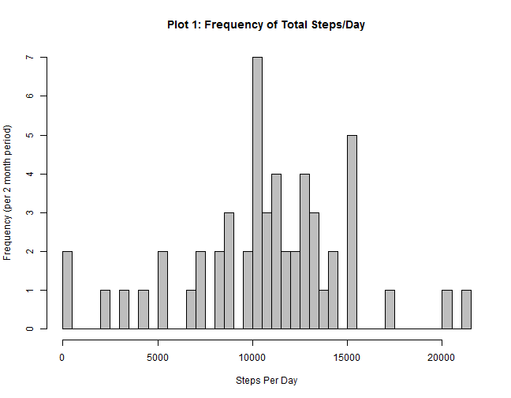
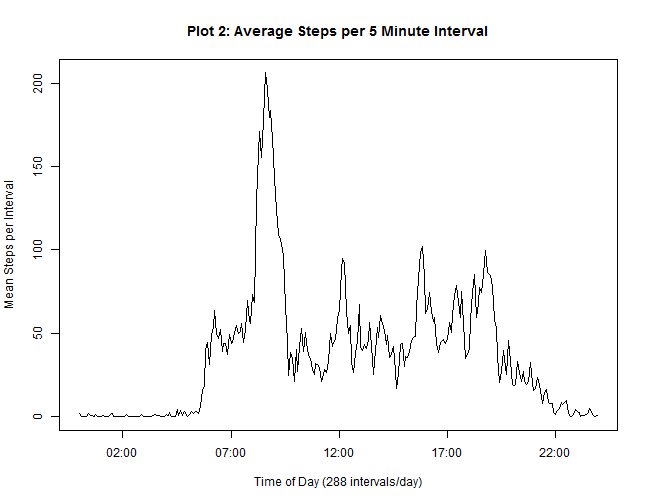
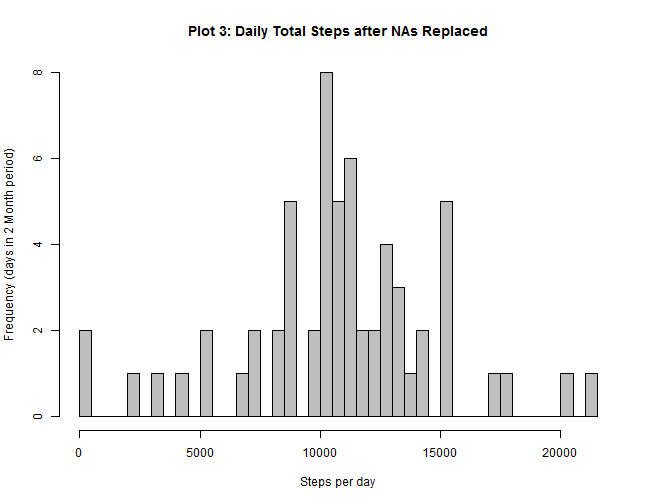
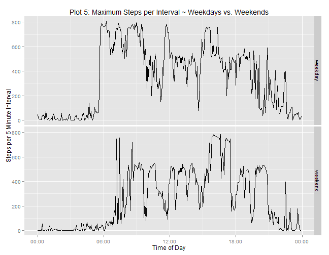

Reproducible Research: Assessment 1 
========================================================
  prepared by WhitefishDontJump, June 2014

### General Note to Peer Reviewer:
I will be weaving text from the assignment's text, including the introduction, data source, and data description into this report.

My responses to questions, including the required R code, are after each question.

Thank you for taking a look at my work and completing the peer assessment.
I hope that you have comments, either on the github commit, or on the assessment form.


### Introduction

It is now possible to collect a large amount of data about personal movement using activity monitoring devices such as a Fitbit, Nike Fuelband, or Jawbone Up. 

These type of devices are part of the “quantified self” movement – a group of enthusiasts who take measurements about themselves regularly to improve their health, to find patterns in their behavior, or because they are tech geeks. But these data remain under-utilized both because the raw data are hard to obtain and there is a lack of statistical methods and software for processing and
interpreting the data. 

This assignment makes use of data from a personal activity monitoring device. This device collects data at 5 minute intervals through out the day. The data consists of two months of data from an anonymous individual collected during the months of October and November, 2012 and include the number of steps taken in 5 minute intervals each day.

### Data

The data for this assignment can be downloaded from the course web site:

  <https://d396qusza40orc.cloudfront.net/repdata%2Fdata%2Factivity.zip>
    

The variables included in this dataset are:

* **steps** : Number of steps taking in a 5-minute interval (missing values are coded as NA)
* **date** : The date on which the measurement was taken in YYYY-MM-DD format
* **interval** : Identifier for the 5-minute interval in which measurement was taken

The dataset is stored in a comma-separated-value (CSV) file and there are a total of 17,568 observations in this dataset.

-------------------------------------------------------------------------------
-------------------------------------------------------------------------------

### Loading and preprocessing the data

Show any code that is needed to

1. Load the data (i.e. read.csv())


2. Process/transform the data (if necessary) into a format suitable for your analysis

--------------------------------------------------------------------------------


```r
if (!file.exists("activity.zip")) {
    
    fileurl = "https://d396qusza40orc.cloudfront.net/repdata%2Fdata%2Factivity.zip"
    download.file(fileurl, destfile = "activity.zip")
    unzip("activity.zip")
    
}

activityraw <- read.csv("activity.csv", colClasses = rep("character", 3))
```

*Comment: The raw interval data are strings of length 1 to 4, with implicit
hours and minutes.*


```r
## The packages I am using are

    library("stringr")
    library("lubridate")
    library("reshape2")
    library("ggplot2")
    library("scales")
```


```r
##  pad the interval string to 4 characters with leading zeros and
##  add a column that combines date and interval values to a POSIXct variable

    activityraw$interval <- str_pad(activityraw$interval, width = 4, pad = "0") 
    activityraw$iposixct <- paste(activityraw$date, activityraw$interval)          
    activityraw$iposixct <- parse_date_time(activityraw$iposixct, "ymd HM")    

    activityraw$steps <- as.numeric(activityraw$steps)
    activityraw$date <- as.Date (activityraw$date) 

    activity <- activityraw[complete.cases(activityraw),]  ## rm NAs
```


### What are the mean and median total number of steps taken per day?

For this part of the assignment, you can ignore the missing values in the dataset.

1. Make a histogram of the total number of steps taken each day

2. Calculate and report the mean and median total number of steps taken per day


```r
##  Recast the data by days and calculate sum for each day

    actmelt <- melt(activity, id.vars = "date", measure.vars="steps" ) 
    actcast <- dcast(actmelt, date ~ variable, fun.aggregate = sum, 
                     na.rm = TRUE)

## create the histogram

    hist(actcast$steps, main = "Plot 1: Frequency of Total Steps/Day",
         xlab = "Steps Per Day", breaks = 40, col = "gray",
         ylab= "Frequency (per 2 month period)")
```

 

*Comment: There are 2 days in the set with 0 steps, in addition to 8 days of NAs which are excluded from this plot.*

```r
    mean(actcast$steps) ; median(actcast$steps)
```

```
## [1] 10766
```

```
## [1] 10765
```


**Answer to Question 2 in this section:**

The **mean is 10,766 steps/day** and the **median is 10,765 steps/day** for the 61 day period ending November 30, 2012.

-------------------------------------------------------------------------------
-------------------------------------------------------------------------------


### What is the average daily activity pattern?

1. Make a time series plot (i.e. type = "l") of the 5-minute interval (x-axis) and the average number of steps taken, averaged across all days (y-axis)

2. Which 5-minute interval, on average across all the days in the dataset, contains the maximum number of steps?


```r
## recast the data by 5 min. interval, then calculate mean for each interval

        stepmelt <- melt(activity, id.vars = c("date", "interval"), 
                         measure.vars= "steps" )

        stepcast <- dcast(stepmelt, interval ~ variable, fun.aggregate = mean, 
                                 na.rm = TRUE)


###     add a column with POSIXct interval for X axis then plot.

        stepcast$intervalct <- parse_date_time (stepcast$interval, "HM")

        plot(x = stepcast$intervalct, y = stepcast$steps, type="l",  
             ylab = "Mean Steps per Interval", 
             xlab = "Time of Day (288 intervals/day)",
             main = "Plot 2: Average Steps per 5 Minute Interval"
             )
```

 

**Answer to Question 2 in this section:**


```r
###     determine the maximum average interval

        stepmax <- stepcast[(max(stepcast$steps)==stepcast$steps),]
```


The time interval with the highest (or maximum) average steps occurs at  **08:35** with a mean of **~ 206** steps.

-------------------------------------------------------------------------------
-------------------------------------------------------------------------------


### Imputing missing values

Note that there are a number of days/intervals where there are missing values (coded as NA). The presence of missing days may introduce bias into some calculations or summaries of the data.

1. Calculate and report the total number of missing values in the dataset (i.e. the total number of rows with NAs)

2. Devise a strategy for filling in all of the missing values in the dataset. The strategy does not need to be sophisticated. For example, you could use the mean/median for that day, or the mean for that 5-minute interval, etc.

3. Create a new dataset that is equal to the original dataset but with the missing data filled in.

4. Make a histogram of the total number of steps taken each day and Calculate and report the mean and median total number of steps taken per day. Do these values differ from the estimates from the first part of the assignment? What is the impact of imputing missing data on the estimates of the total daily number of steps?

----------------------------------------------------------------------------


```r
    sum(!complete.cases(activityraw)); mean(is.na(activityraw$steps))
```

```
## [1] 2304
```

```
## [1] 0.1311
```

**Response to Question 1 in this Section:**

There are **2,304** rows with missing 'steps' data.

In other words, about **13 %** of the step data is NA.


-------------------------------------------------------------------------------


**Question 2: Explanation: Strategy for filling missing data**

All of the NAs occur on 8 dates out of 61 dates, which is **13%** of the dates, consistent with total NA count.

As a result, there are only **53** observations for each interval.

Using a uniform distribution, seeded, with range, 0.5 to 53.5, and subsequently
rounded to give an integer value (1 to 53),  this random result can specify which 
date to select from the 53 dates with good data.

For each missing step value, a value from the same interval on another date will replace the NA. The date will be chosen using runif() to execute the random uniform selection. This will be applied to all NA values of the variable "steps".

Both the uniformity of the dates selected by this method, and the resulting data will be summarized for comparison with the original data set


```r
## segregate good and bad data

actbad <- activityraw[!complete.cases(activityraw), ]  ## df of NAs

datelist <- unique(activity$date)  ## unique non-NA dates, 10/02 - 11/29

## create a uniformly distributed vector of good dates with length equal to
## the rows of NA data (actbad)

set.seed(42)

randlist <- datelist[round(runif(n = nrow(actbad), min = 0.5, max = (length(datelist + 
    0.5))))]

## verify good distribution of dates

summary(randlist)
```

```
##         Min.      1st Qu.       Median         Mean      3rd Qu. 
## "2012-10-02" "2012-10-15" "2012-10-28" "2012-10-30" "2012-11-16" 
##         Max. 
## "2012-11-29"
```

```r
## replace the NAs steps in actbad with selected values from activity To Do:
## Replace for() with sapply, time permitting

intervalist <- actbad[, "interval"]

for (i in seq_along(randlist)) {
    
    actbad[i, 1] <- activity[(randlist[i] == activity$date) & (intervalist[i] == 
        activity$interval), "steps"]
    
}

## combine data to make the new dataset (Question 3 in this section)

newact <- rbind(activity, actbad)

newact <- newact[order(newact$iposixct), ]
```

-------------------------------------------------------------------------------

**Responses to Question 4 for this section of the assignment**


```r
## prep histogram

    newmelt <- melt(newact, id.vars = "date", measure.vars= "steps" )

    newcast <- dcast(newmelt, date ~ variable, fun.aggregate = sum, 
                     na.rm = TRUE)

    hist(newcast$steps, main = "Plot 3: Daily Total Steps after NAs Replaced",
         xlab = "Steps per day", breaks = 40, col = "gray",
         ylab= "Frequency (days in 2 Month period)")
```

 

```r
    mean(newcast$steps) ; median(newcast$steps)
```

```
## [1] 10826
```

```
## [1] 10714
```

**Remarks (#4 in 'Imputing missing values section)**


The replacement of NAs **changed the daily steps mean by 
0.56%
and the median by -0.47%.**

Imputing data to the NAs changed the **total steps to 660,396 from 570,608.**  This change in totals is consistent with adding 8 days of missing data to the 53 days of good data to create the 61 day dataset.

Here is a comparison of summary statistics before & after imputing values to NAs:

```
##             Min. 1st Qu. Median  Mean 3rd Qu.  Max.
## ImputedSet    41    8918  10714 10826   12883 21194
## OriginalSet   41    8841  10765 10766   13294 21194
## NetChanges     0      77    -51    60    -411     0
```
Imputing the missing data did not significantly alter the summary statistics.  

**In summary, the uniform random data and interval matching strategy worked as expected:**  
The NAs were replaced with representative values which did not substantially alter the character of the data.

-------------------------------------------------------------------------------

### Are there differences in activity patterns between weekdays and weekends?

For this part the weekdays() function may be of some help here. Use the dataset with the filled-in missing values for this part.

1. Create a new factor variable in the dataset with two levels – “weekday” and “weekend” indicating whether a given date is a weekday or weekend day.

2. Make a panel plot containing a time series plot (i.e. type = "l") of the 5-minute interval (x-axis) and the average number of steps taken, averaged across all weekday days or weekend days (y-axis).

-------------------------------------------------------------------------------

**Responses to Questions in this Section:**


```r
## part 1: building a two level factor per #1 using wday() function which
## returns a day of week number and a character vector to set 'weekday' for
## 2:5 and 'weekend' for 1,7 - and then bind to df as factor.

weeker <- c("weekend", rep("weekday", 5), "weekend")

newact$dayo <- as.factor(weeker[wday(newact$date)])
```

*Comment: While the assignment suggested the weekdays() function,  I chose the wday() function. It returns an integer value for day and required less typing. ;)*


```r
## Prepare the panel plot per Question 2 in this section

## recast the data by 5 min. interval, then calculate mean for each interval

        daymelt <- melt(newact, id.vars = c("dayo", "interval"), 
                         measure.vars= "steps")

        daycast <- dcast(daymelt, dayo + interval ~ variable, 
                         fun.aggregate = mean)

##     add a column with POSIXct interval for X axis and then plot.

        daycast$intervalct <- parse_date_time (daycast$interval, "HM")

        x = ggplot(daycast, aes(x = intervalct, y = steps))
        x = x + geom_line() + facet_grid(dayo~.)
        x = x + labs(x = "Time of Day", 
                     y = "Steps per 5 Minute Interval" )
        x = x + ggtitle("Plot 4: Mean Steps per Interval ~ Weekdays vs. Weekends")
        x = x + scale_x_datetime(labels = date_format("%H:%M"))
        print(x)
```

 


*Comments:*

*1. Weekends seem to be characterized by sleeping in, followed by more changes in activity levels throughout the day, and staying up later.*

*2, The maximum weekday value at 8:35 AM is higher than any weekend peak. This peak may be associated with an exercise routine or commuting.* 

*A plot of the maximum value per interval follows.  While not required by the
assignment, the occurance of some sporadic activities may be masked by the means.*

    

```r
## Prepare the panel plot for maximum values weekday and weekend intervals

## recast the data by 5 min. interval, then calculate max for each interval

    maxcast <- dcast(daymelt, dayo + interval ~ variable, 
                         fun.aggregate = max, "")  ## needed dummy arg

    maxcast$steps <- as.numeric(maxcast$steps) ## dcast made it "character"

## add a column with POSIXct interval for X axis and then plot.

    maxcast$intervalct <- parse_date_time (maxcast$interval, "HM")

    x = ggplot(maxcast, aes(x = intervalct, y = steps))
    x = x + geom_line() + facet_grid(dayo~.)
    x = x + labs(x = "Time of Day", 
                 y = "Steps per 5 Minute Interval" )
    x = x + ggtitle("Plot 5: Maximum Steps per Interval ~ Weekdays vs. Weekends")
    x = x + scale_x_datetime(labels = date_format("%H:%M"))
    print(x)
```

 

*Comments:*

*1. The plot of maximum steps per interval provides a better context for the maximum mean value at 8:35 AM.*
    
*2. There are multiple intervals on both weekdays and weekends with maxima that are 700 to 800 steps per interval. This rate is more than 2 steps per second. Perhaps an exercise routine that is done on different times (but usually in the early morning) is the cause of the higher maxima.*


    
**Thank you for reviewing my work.**

I hope that you will leave comments, both appreciative and constructively critical, with suggestions for improvements.


end of assignment.
